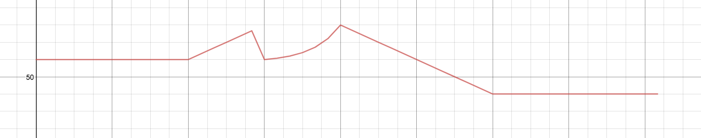

# Automation

*Intended audience: Brandon, interested ovoids*

Automation is an important part of any DAW, so I put quite a bit of effort into making it performant and generic.

In its most distilled form, an automation defines a mapping between a beat or time to the value of a parameter at that beat or time. We break up an automation into segments so we can build up more complex functions as a piecewise (effectively) of smaller functions.

I need to add more segments, but as of writing this file there are four types of segments:

ConstantAutomationSegment, LinearAutomationSegment, ExponentialAutomationSegment, QuadraticAutomationSegment

ConstantAutomationSegment has the following constructor:

`constructor(x1, x2, c)`

which produces a segment with value c from x1 to x2.

LinearAutomationSegment has the following constructor:

`constructor(x1, y1, x2, y2)`

producing a segment linearly interpolating between (x1, y2) and (x2, y2).

ExponentialAutomationSegment has the following constructor:

`constructor(x1, y1, x2, y2, yc)`

producing a segment exponentially interpolating between (x1, y1), ((x1 + x2) / 2, yc), and (x2, y2). You can think of yc as being the y value of that little circle in the middle of the automation segment you can drag around in FL to change the curvature. Note that we must have yc between y1 and y2, otherwise no exponential function satisfies this curve.

QuadraticAutomationSegment has the following constructor:

`constructor(x1, y1, x2, y2, yc)`

producing a segment quadratically interpolating between (x1, y1), ((x1 + x2) / 2, yc), and (x2, y2). Unlike the exponential case, yc can be outside of the y1, y2 range, but the minimum/maximum values of the segment may also be outside of that range. If you want to keep them in the range, then restrict yc to be between (3y1 + y2) / 4 and (3y2 + y1) / 4.

There will almost certainly be more segments to program, but I haven't gotten around to that yet.

The class combining these segments into a uniform automation is, well, Automation. You can construct it from an array of segments already, or you can progressively build it up:

`constructor(segments = [])`

The addSegment function allows you to append a segment to the Automation. There's a handful of functions used to further manipulate segments:

**addSegment**

getSegment(i): returns the ith segment, throws error if out of bounds

**setSegment**(i, seg): sets the ith segment to seg

**insertSegment**(i, seg): inserts a segment at index i

**removeSegment**(i): removes the segment at index i

**removeSegmentIf**(func): removes all segments s where func(s) evaluates to true

**clearSegments**(): removes all segments

These functions may be useful when you (Brandon) are implementing the automation manipulation with snap. For example, you can implement a drag of an automation point over by 1 unit by just increasing or decreasing the length of that segment by 1 and calling update():

```js
automation.getSegment(segment_index).length += 1;

automation.update(); // automation is now shifted over by 1 unit at that segment
```

As you add segments, you may notice that their x values change. That's because what the Automation does is move around the segments so that they are all touching, preserving their length. The **bolded** functions up there do this automatically when you call them, but if you've done something manually that didn't update the segments, they may be intersecting or have gaps. This is a bad state of affairs: most of the algorithms assume that all the segments are touching as defined in the specification. Thus, you should call the update() function which will justify all the automation segments to the correct place.

Here's an Automation from scratch:

```javascript
let automation = new Automation();

automation.addSegment(new ConstantAutomationSegment(0, 4, 60)); // length 4
automation.addSegment(new ExponentialAutomationSegment(0, 60, 2, 80, 70)); // length 2
automation.addSegment(new ExponentialAutomationSegment(0, 60, 2, 80, 64)); // length 2
automation.addSegment(new LinearAutomationSegment(0, 80, 4, 40)); // length 4
```

Notice that the x values we gave the segments, taken literally, would make all the segments intersect! But as we add segments, they get shifted appropriately. In this case, the new starting x values for each will be:

0, 4, 6, 8, 10.

An illustration of Automation:

```javascript
automation.length // -> 12
automation.ymin() // -> 40
automation.ymax() // -> 80
automation.valueAt(2) // -> 60
automation.valueAt(7) // -> 64
automation.valueAt(6.4) // -> 60.98813...
```

This is what the automation actually looks like (note that the first peak should go the same height as the second, but desmos can't graph it because it's limited to 50 points. In reality, the first peak has a discontinuity, which this system is designed to support):



If you want to get a large number of valueAt (or derivativeAt, etc.) values, say, for converting to SVG, you should use the getValues method. First, construct a sorted float array (Float32Array and Float64Array are both acceptable) containing the x values where you want to evaluate the segment. Then call the getValues function on that array, and it will overwrite the array's values with the corresponding automation values. Note that the array must be a FloatArray and it must be SORTED, otherwise it will default to a much, much slower algorithm that's not much faster than just doing valueAt for each value. Here's an example:

```javascript
let array = new Float64Array([0,0.5,1,1.5,2,2.5,3,3.5,4,4.5,5,5.5,6,6.5,7,7.5,8,8.5,9,9.5,10]);

automation.getValues(array);

// array is now Float64Array(21) [60, 60, 60, 60, 60, 60, 60, 60, 60, 65, 70, 75, 60, 61.333333333333336, 64, 69.33333333333333, 80, 75, 70, 65, 60]
```

That's about it, thanks for watching!
