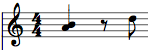
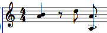
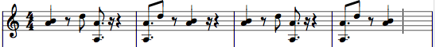

# KeyboardPitch, KeyboardNote, KeyboardNoteGroup

This deals with how we model notes, which will be critical (among other things) in writing patterns.

### KeyboardPitch

A KeyboardPitch is a number between 0 and 144, corresponding with the concept of a physical key on the keyboard. 0 is C-1 (about 8 Hz in standard tuning); 144 is C11 (about 33500 Hz). This extended range is primarily for ease of use when using tuning systems that have more than 12 notes per octave.

To convert a KeyboardPitch to a more recognizable name, use the TONES.noteToName function. nameToNote is the inverse operation:

```javascript
TONES.nameToNote("A#4") // -> 70
TONES.nameToNote("Bb4") // -> 70
TONES.nameToNote("Bbb4") // -> 69
TONES.nameToNote("G##4") // -> 69
TONES.nameToNote("C-1") // -> 0
TONES.nameToNote("C11") // -> 144

TONES.noteToName(60) // -> "C4"
TONES.noteToName(80) // -> "G#4"
```

There used to be an actual class for KeyboardPitch, but I don't think that's very useful. For convenience, if you forget what pitch a note is, you can also use KeyboardPitches:

```javascript
TONES.KeyboardPitches.A4 // -> 69
TONES.KeyboardPitches.As4 // -> 70
```

Also for convenience, there's noteTo12TET to convert a note to its 12TET frequency:

```javascript
TONES.noteTo12TET(69) // -> 440
TONES.noteTo12TET(60) // -> 261.6255653...
```

### KeyboardNote

A KeyboardNote is closer to what we'd normally consider a "note." It's a pitch with a start time (*start*), a duration (*length*), a velocity (*vel*), a pan (*pan*), a fine pitch adjustment (*fine*), and a custom object (*custom*) where you can define your own properties. We construct it with a parameter object like so:

```javascript
let note = new KeyboardNote({pitch: "A4", length: 1, start: 2, vel: 0.5});
```

*start* can be negative. *length* should not be negative, but this is loosely enforced. The standard range of *vel* is 0 to 1 inclusive. The standard range of *pan* is -1 (left) to 1 (right), inclusive. *fine* has an indeterminate range. *pitch* can be passed as a string, or as a number (obviously the latter doesn't require it to do a conversion).

KeyboardNote has a getter/setter for *end*, which is the end of the note (start + length). For convenience in KeyboardNoteGroup, it has simple functions like translateX, scaleX, and transpose, but you shouldn't have to use these much. It also has a clone() function, which returns a copy of the note. Note that the "custom" object IS copied, but it is a SHALLOW copy (only copies the top level items, the lower level ones are the same old objects). For example:

```javascript
let note = new TONES.KeyboardNote({pitch: "A4", length: 1, start: 2, vel: 0.5, custom: {eggnog : true}});

let duplicate = note.clone();
note === duplicate; // false

duplicate.custom.eggnog = false;

note === duplicate; // false
note.custom.eggnog; // true

note.custom.deep = {impact: true};

duplicate.custom.deep; // undefined
let duplicate2 = note.clone();

duplicate2.custom.deep.impact = false;
note.custom.deep.impact; // false
```

What goes in *custom* besides mod wheel data, I don't know yet. It may even be mini automations that you can control specifically for each note!

### KeyboardNoteGroup

KeyboardNoteGroup is just a collection of KeyboardNotes. It can have chords, it can have overlapping notes; it can even have identical notes.

To construct a KeyboardNoteGroup, you can pass an array to the constructor:

```javascript
let group = new TONES.KeyboardNoteGroup([
  new TONES.KeyboardNote({pitch: "A4", start: 0, length: 1}),
  new TONES.KeyboardNote({pitch: "B4", start: 0, length: 1}),
  new TONES.KeyboardNote({pitch: "D5", start: 1.5, length: 0.5})
]);
```

This will create something like this:



You can also add notes to the NoteGroup with addNote:

```javascript
group.addNote(new TONES.KeyboardNote({pitch: "A3", start: 2, length: 0.75}));
group.addNote(new TONES.KeyboardNote({pitch: "A4", start: 2, length: 0.75}));
```



It's worth noting that despite my images here, these "start" and "length" could have any unit: beats, seconds, minutes, whatever; not necessarily quarter notes. This is designed to be sufficiently abstract for that.

To delete a note, you should probably use deleteNoteIf, which takes in a function and deletes all notes that satisfy that function. For example, if you wanted to delete all A4's from our group, you could do

```javascript
group.deleteNote(note => note.pitch === TONES.nameToNote("A4"));
```

You can translate a group using translateX(x_shift), which shifts it. You can scale a group in size using scaleX(scale_factor). The getter *noteCount* tells you how many notes there are in the group. You can transpose a group with the transpose(semitones) function. You can apply a function *func* to all notes with the apply(*func*) function, and select all notes that satisfy a function with select(*func*). You can test whether notes satisfy a function with *all* (do all notes satisfy?) and *some* (do any notes satisfy?). minX() gives the minimum x value; maxX() gives the maximum x value. minPitch() gives the lowest note, and maxPitch() gives the highest note. generateNotes will be used internally by me. *snip* takes a group and cuts it off between start_x and end_x, returning a new group; notes that get cut through are trimmed, not deleted entirely. *join* allows you to combine two groups. *clone* let's you clone the group. *add* is the equivalent of join but returns a new, separate group. *repeat* repeats the group some number of times. Finally, removeIntersections() removes all intersections in notes.

As an example, suppose we hadn't deleted the A4s and we had those 5 notes from before (as in the last image).

```javascript
group.translateX(1);
group.minX(); // -> 1
group.maxX(); // -> 3.75
group.translateX(-1);
group.minX(); // -> 0
TONES.noteToName(group.minPitch()); // -> A3
TONES.noteToName(group.maxPitch()); // -> D5
group.all(note => note instanceof TONES.KeyboardNote); // -> true
group.some(note => note.pitch === 69); // true
group.transpose(1);
TONES.noteToName(group.minPitch()); // -> A#3
let group2 = group.clone();
group.transpose(-1);
group2.reverse();
group.join(group2, true, 4);
group.repeat(2, 8);
```

Now, *group* will look something like this:


